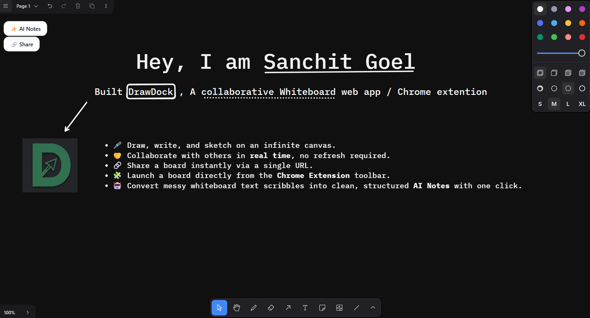
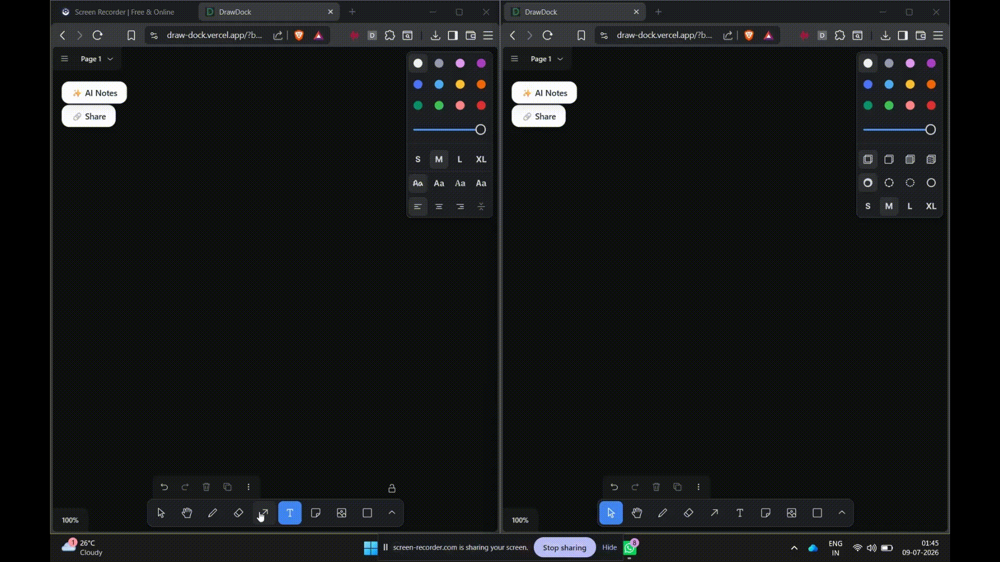
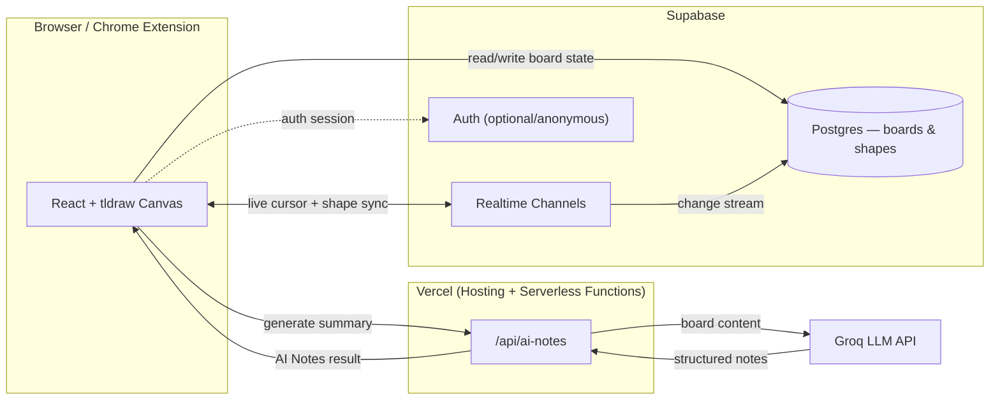

<div align="center">


# 🎨 DrawDock

### AI-Powered Collaborative Whiteboard & Chrome Extension

**React · tldraw · Supabase · Groq AI · Vercel**

*A production-grade digital board for real-time collaboration, note-taking, and online learning — packaged as a free Chrome Extension.*

[](https://draw-dock.vercel.app/)
[](https://react.dev)
[](https://supabase.com)

**🌐 Live Demo** · [drawdock.vercel.app](https://YOUR-VERCEL-LINK.vercel.app)  ·  **📦 Extension** · [Installation Guide](#-chrome-extension)

⭐ *If DrawDock is useful to you, consider starring the repo — it genuinely helps.*

</div>

---

## 📑 Table of Contents

- [Overview](#-overview)
- [Why DrawDock](#-why-drawdock)
- [Demo](#-demo)
- [Screenshots](#-screenshots)
- [Features](#-features)
- [Tech Stack](#-tech-stack)
- [Architecture](#-architecture)
- [Project Workflow](#-project-workflow)
- [AI Notes](#-ai-notes)
- [Real-Time Collaboration](#-real-time-collaboration)
- [Chrome Extension](#-chrome-extension)
- [Folder Structure](#-folder-structure)
- [Installation](#-installation)
- [Environment Variables](#-environment-variables)
- [Deployment](#-deployment)
- [AI Tools Used](#-ai-tools-used)
- [Challenges & Learnings](#-challenges--learnings)
- [Roadmap / Future Improvements](#-roadmap--future-improvements)
- [Contributing](#-contributing)
- [License](#-license)
- [Author](#-author)

---

## 🚀 Overview

**DrawDock** is an AI-powered collaborative whiteboard built for brainstorming, note-taking, and online learning sessions.

With DrawDock, users can:

- 🖊️ Draw, write, and sketch on an infinite canvas.
- 🤝 Collaborate with others in **real time**, no refresh required.
- 🔗 Share a board instantly via a single URL.
- 🧩 Launch a board directly from the **Chrome Extension** toolbar.
- 🤖 Convert messy whiteboard scribbles into clean, structured **AI Notes** with one click.

The goal wasn't just to check off feature boxes — it was to build something that feels lightweight and fast for the end user, while under the hood demonstrating real production-engineering concerns: realtime data sync, conflict-free collaboration, serverless AI endpoints, extension packaging, and deployment.

> 💡 **Origin note:** DrawDock started life as a take-home engineering assignment (*"build a collaborative digital board as a Chrome Extension"*). It has since evolved into an actively maintained personal project, with the AI Notes feature, refined architecture, and extension polish added afterward.

---

## 🤔 Why DrawDock

Most whiteboard tools are either:
- **Too heavy** (Miro, FigJam) — great for teams, overkill for a quick class discussion or personal note dump, or
- **Too disconnected** — a whiteboard tab that's one more thing to alt-tab into instead of living where you already work: the browser toolbar.

DrawDock is designed to be **one click away**, disposable-but-shareable, and smart enough to turn a chaotic brainstorming session into something you'd actually want to re-read later — thanks to AI-generated summaries of your board.

---

## 🎥 Demo

🌐 **Live App:** [`https://YOUR-VERCEL-LINK.vercel.app`](https://YOUR-VERCEL-LINK.vercel.app)

| Scenario | Try it |
|---|---|
| Create a new board | Visit the link → click **New Board** |
| Real-time collaboration | Open the same board URL in two tabs / two devices |
| AI Notes | Draw/write freely → click **✨ AI Notes** |
| Chrome Extension | Install via [Installation](#-installation) → click the toolbar icon |

---

## 📸 Screenshots

> Add your captures to an `images/` folder at the repo root using the file names below — they'll render automatically once added.

| Preview | Description |
|---|---|
| `images/home.png` | Whiteboard canvas, toolbar, drawings, and sticky notes |
| `images/collaboration.gif` | Two browser windows, live cursor + stroke sync in action |
| `images/ai-notes.png` | AI button and the generated notes popup |
| `images/share.png` | Share button + "Link Copied" toast |
| `images/extension.png` | Chrome Extension popup UI |
| `images/install-extension.png` | `chrome://extensions` → Developer Mode → Load unpacked |

```md
<!-- Example embed once images are added -->


```

---

## ✨ Features

### 🎨 Infinite Whiteboard
- Freehand drawing, shapes, arrows, and connectors
- Rich text boxes and sticky notes
- Multi-select, resize, rotate, layer, and group objects
- Infinite pan & zoom canvas powered by **tldraw**

### 🤝 Real-Time Collaboration
- Live multi-cursor presence — see collaborators' names and cursors move in real time
- Instant sync of every stroke, shape, and note across all connected clients
- Powered by **Supabase Realtime** (Postgres change streams + broadcast channels) — no custom WebSocket server to maintain

### 🔗 Shareable Boards
- Every board gets a unique UUID (`/board/:id`)
- One-click **Copy Link** to invite collaborators — no sign-up required to join
- Boards persist in Supabase, so they survive refreshes and can be revisited later

### 🤖 AI Notes
- One click sends the board's text/shape content to **Groq** (running Llama-family models for low-latency inference)
- Returns a clean, structured summary — bullet points, key ideas, and action items pulled out of a messy board
- Ideal for turning a live class/brainstorm into shareable takeaways afterward

### 🏫 Built for Online Classes
- Annotation-friendly canvas for walking through problems live
- Shareable link makes it trivial to hand a board to a class or study group
- Sticky notes + freehand drawing cover both structured notes and quick diagrams

### 🧩 Chrome Extension
- One click from the browser toolbar opens a new or existing board
- Lightweight popup UI — no heavyweight in-page injection
- Works alongside video calls (Meet/Zoom) in a separate tab or window

### 📱 Responsive, Intuitive UI
- Minimal toolbar, keyboard shortcuts, and familiar whiteboard interaction patterns
- Works across desktop browser widths; touch-friendly drawing input supported

---

## 🛠 Tech Stack

| Layer | Technology | Purpose |
|---|---|---|
| **Frontend** | React + Vite | UI framework & build tooling |
| **Canvas Engine** | [tldraw](https://tldraw.dev) | Infinite whiteboard primitives (shapes, drawing, camera) |
| **Realtime & Storage** | [Supabase](https://supabase.com) (Postgres + Realtime + Auth) | Board persistence, live sync, presence |
| **AI Layer** | [Groq API](https://groq.com) | Fast LLM inference for AI Notes summarization |
| **Hosting** | [Vercel](https://vercel.com) | Frontend hosting & serverless API routes |
| **Extension** | Chrome Manifest V3 | Browser toolbar packaging |
| **Styling** | Tailwind CSS | Utility-first responsive styling |

---

## 🏗 Architecture



**Key decisions:**
- **tldraw over a hand-rolled canvas** — battle-tested shape/selection/zoom logic, saving weeks of engineering for a solved problem.
- **Supabase Realtime over a custom WebSocket server** — Postgres-backed persistence and pub/sub in one managed service, avoiding a separate backend to deploy and scale.
- **Groq for AI Notes** — chosen for inference speed, so summarization feels instant rather than a multi-second spinner.
- **Serverless API route for AI calls** — keeps the Groq API key off the client and out of the extension bundle.

---

## 🔄 Project Workflow

1. User opens DrawDock (web app or extension popup).
2. A new board is created with a unique UUID, or an existing board is loaded by ID.
3. Every draw/edit action is written to Supabase and broadcast over a Realtime channel.
4. All other clients subscribed to that board ID receive the update and re-render instantly.
5. When the user clicks **AI Notes**, the current board's text/shape content is sent to a Vercel serverless function.
6. The function calls the Groq API and returns a structured summary, rendered in a popup.
7. The user shares the board URL — or exports/keeps the AI-generated notes.

---

## 🤖 AI Notes

The AI Notes feature is DrawDock's signature capability: it bridges the gap between *messy live collaboration* and *usable, structured output*.

- **Trigger:** Single click on the ✨ AI Notes button.
- **Input:** Text elements, sticky note contents, and labeled shapes on the current board.
- **Model:** Groq-hosted LLM, chosen for near-instant response times.
- **Output:** A structured summary — key points, decisions, and action items — displayed in-app and copyable.

This turns a chaotic 30-minute brainstorm or class session into something worth revisiting later, without anyone manually taking notes during the session.

---

## 🔴 Real-Time Collaboration

- Built on **Supabase Realtime**, combining Postgres change data capture with broadcast channels for cursor/presence events.
- Each board acts as its own "room" — clients subscribe by board UUID.
- Presence events show who's currently active on a board (name/color-coded cursor).
- Designed to gracefully re-sync state if a client reconnects after a dropped connection.

---

## 🧩 Chrome Extension

The extension is a thin, Manifest V3 wrapper that gets DrawDock one click away from anywhere in the browser.

**What it does:**
- Toolbar icon opens a popup with **New Board** and **Recent Boards**.
- Selecting a board opens it in a new tab, pointed at the deployed web app.
- No page injection or content scripts — keeps it lightweight and low-permission.

### Installing the Extension Locally

1. Clone this repository.
2. Build the extension (if applicable): 
   ```bash
   cd extension
   npm install
   npm run build
   ```
3. Open Chrome and go to `chrome://extensions`.
4. Enable **Developer Mode** (top-right toggle).
5. Click **Load unpacked** and select the `extension/dist` (or `extension/`) folder.
6. Pin the DrawDock icon to your toolbar for one-click access.

---

## 📂 Folder Structure

```
drawdock/
├── extension/               # Chrome Extension (Manifest V3)
│   ├── manifest.json
│   ├── popup/
│   └── icons/
├── src/                      # React web app
│   ├── components/           # Toolbar, Board, StickyNote, ShareModal, AINotesPanel
│   ├── hooks/                 # useRealtimeBoard, usePresence, useAINotes
│   ├── lib/                   # Supabase client, Groq client
│   ├── pages/
│   └── App.jsx
├── api/                       # Vercel serverless functions
│   └── ai-notes.js
├── images/                    # README screenshots/gifs
├── public/
├── .env.example
├── package.json
└── README.md
```

---

## ⚙️ Installation

### Prerequisites
- Node.js 18+
- A free [Supabase](https://supabase.com) project
- A free [Groq](https://console.groq.com) API key

### 1. Clone the repo
```bash
git clone https://github.com/<your-username>/drawdock.git
cd drawdock
```

### 2. Install dependencies
```bash
npm install
```

### 3. Configure environment variables
```bash
cp .env.example .env
```
Fill in the values as described in [Environment Variables](#-environment-variables).

### 4. Set up Supabase
- Create a new Supabase project.
- Run the SQL schema in `supabase/schema.sql` (boards table + Realtime enabled) via the Supabase SQL editor.

### 5. Run locally
```bash
npm run dev
```
The app will be available at `http://localhost:5173`.

### 6. (Optional) Load the Chrome Extension
See [Chrome Extension → Installing the Extension Locally](#-chrome-extension).

---

## 🔐 Environment Variables

Create a `.env` file in the project root:

```env
# Supabase
VITE_SUPABASE_URL=your-supabase-project-url
VITE_SUPABASE_ANON_KEY=your-supabase-anon-key

# Groq (server-side only — used inside /api routes)
GROQ_API_KEY=your-groq-api-key
```

> ⚠️ Never expose `GROQ_API_KEY` on the client. It's only read inside the serverless `/api/ai-notes` function.

---

## ☁️ Deployment

DrawDock is deployed on **Vercel**.

1. Push the repo to GitHub.
2. Import the project into [Vercel](https://vercel.com/new).
3. Add the environment variables from [above](#-environment-variables) in the Vercel project settings.
4. Deploy — Vercel automatically builds the React app and provisions the `/api` serverless functions.
5. Update the extension's popup to point at your deployed URL instead of `localhost`.

---

## 🤝 AI Tools Used

This project was built with heavy, intentional use of AI-assisted development:

| Tool | How it was used |
|---|---|
| **Claude** | Architecture decisions, README/documentation drafting, debugging Supabase Realtime edge cases |
| **GitHub Copilot / Cursor** | In-editor autocomplete for boilerplate React components and Tailwind styling |
| **ChatGPT / Gemini** | Exploring tldraw API options, comparing realtime backends before settling on Supabase |
| **Groq (product feature, not just a dev tool)** | Powers the in-app AI Notes summarization feature end users interact with |

AI tools accelerated boilerplate and research, but every architectural decision — tldraw vs. custom canvas, Supabase vs. a custom WebSocket server, Groq for low-latency summarization — was made and validated manually against the project's actual requirements.

---

## 🧗 Challenges & Learnings

- **Conflict resolution in realtime sync** — ensuring two users editing the same shape simultaneously don't cause flicker or lost updates required careful use of Supabase's broadcast + Postgres change events together, rather than relying on one alone.
- **Keeping the extension lightweight** — resisting the urge to inject content scripts into every page, and instead keeping the extension a thin popup pointing at the hosted web app.
- **Balancing AI Notes speed vs. quality** — tuning prompts for Groq to produce genuinely useful structured summaries rather than generic restatements of the board content.

---

## 🗺 Roadmap / Future Improvements

- [ ] Persistent user accounts and "My Boards" dashboard
- [ ] Voice-to-sticky-note transcription for classroom use
- [ ] Exporting boards as PDF/PNG
- [ ] Threaded comments/discussion pinned to specific board regions
- [ ] Offline support with sync-on-reconnect
- [ ] Chrome Web Store listing (currently install via "Load unpacked")
- [ ] Mobile-friendly touch drawing improvements

---

## 🙌 Contributing

This is currently a personal project, but issues, suggestions, and pull requests are welcome. Feel free to open an issue if you spot a bug or have a feature idea.

---

## 📄 License

Licensed under the [MIT License](LICENSE).

---

<div align="center">

## 👨‍💻 Author

**Sanchit Goel**

[](https://github.com/<your-username>)
[](https://linkedin.com/in/<your-linkedin>)

*Built with ☕, curiosity, and a healthy amount of AI pair-programming.*

</div>
